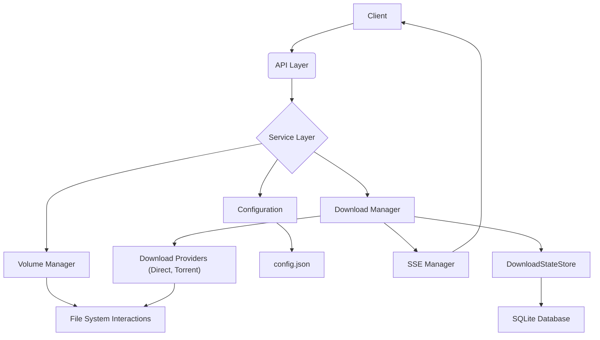
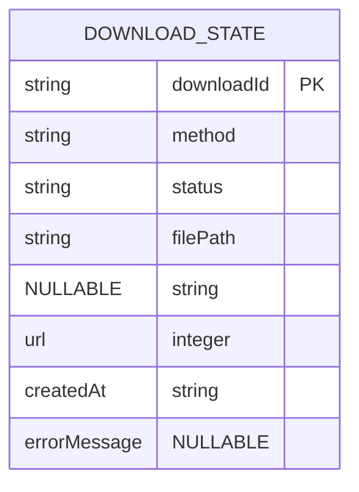

# Project Architecture

This document outlines the architecture for the `downloads-server` project, focusing on modularity, scalability, and maintainability.

## High-Level Overview

The `downloads-server` is structured as a layered application, with clear separation of concerns. It primarily consists of:

- **API Layer:** Handles incoming HTTP requests and sends responses.
- **Service Layer:** Contains the core business logic, orchestrating operations.
- **Manager Layer:** Manages specific functionalities like downloads, volumes, and Server-Sent Events.
- **Data Layer:** Handles data persistence and retrieval.
- **Utility/Helper Layer:** Provides common functionalities used across the application.

## Key Concepts

### Download Methods

The `downloads-server` is designed to support various download methods (e.g., direct HTTP/HTTPS, BitTorrent via `.torrent` files, or Magnet URIs). The architecture promotes extensibility, allowing new download methods to be integrated seamlessly by implementing a common interface. When a download request is initiated, the server responds with a `downloadId`, which is then used for monitoring progress and status.

### Volumes

For detailed information on how volumes are managed and configured, refer to the [Volumes Documentation](volumes.md).

## Detailed Architecture

### 1. API Layer (`src/api`)

- **Purpose:** Exposes RESTful endpoints for clients to interact with the download server.
- **Technologies:** Express.js.
- **Components:**
  - `routes/`: Defines API routes (e.g., `/downloads/start`, `/downloads/:id/status`).
  - `controllers/`: Handles request parsing, validation, and delegates to the Service Layer.
  - `middlewares/`: Implements request validation.

### 2. Service Layer (`src/services`)

- **Purpose:** Encapsulates the core business logic and orchestrates operations between different managers.
- **Components:**
  - `DownloadService`: Manages the lifecycle of a download request, interacting with the `DownloadManager`.
  - `VolumeService`: Provides an interface for volume-related operations, interacting with the `VolumeManager`.

### 3. Manager Layer

#### 3.1. Download Manager (`src/managers/download`)

- **Purpose:** Manages the initiation, progress tracking, and completion of downloads across various methods.
- **Components:**
  - `DownloadProviders/`: Abstraction for different download methods. Each provider implements a common interface, making it easy to add new download types.
    - `DirectDownloadProvider`: Handles HTTP/HTTPS downloads.
    - `TorrentDownloadProvider`: Handles `.torrent` files using `webtorrent`.
  - `DownloadStateStore`: Manages the persistence and retrieval of download states. It utilizes a SQLite database for long-term storage, identified by the `downloadId`. For detailed information on database usage and TypeORM, refer to the [Database Usage and TypeORM](database.md) documentation.

#### 3.2. Volume Manager (`src/managers/volume`)

- **Purpose:** Manages the configured download volumes, including space allocation, availability checks, and selection based on tags.

#### 3.3. SSE Manager (`src/managers/sse`)

- **Purpose:** Manages Server-Sent Events connections for real-time download progress updates.
- **Components:**
  - `SseManager`: Handles client connections and disconnections, and broadcasts events to subscribed clients.

### 4. Data Layer (`src/entities`)

- **Purpose:** Defines the data models for the application and handles data persistence.
- **Technologies:** TypeORM, SQLite.
- **Components:**
  - `DownloadState.ts`: Defines the `DownloadState` entity, which represents the state of a download.

#### Database and Data Persistence

The `downloads-server` utilizes **SQLite** as its lightweight, file-based database for persistent storage. **TypeORM** serves as the Object-Relational Mapper (ORM), abstracting database interactions and allowing the application to work with TypeScript entities.

The primary entity stored in the database is `DownloadState`, which captures the essential information about each download operation.

This setup ensures that all relevant information about ongoing and completed downloads is persistently stored and can be retrieved even after server restarts.

### 5. Configuration (`src/config`)

- **Purpose:** Loads, validates, and provides access to the application's configuration, primarily from `config.json`.
- **Technologies:** Zod for robust schema validation.
- **Components:**
  - `config.ts`: Defines TypeScript interfaces and Zod schemas for the configuration structure.
  - `index.ts`: Responsible for reading, parsing, and validating `config.json` at application startup. The server will not start if the configuration is invalid.

### 6. Utilities/Helpers (`src/utils`)

- **Purpose:** Provides common utility functions and cross-cutting concerns.
- **Components:**
  - `logger.ts`: Centralized logging utility.
  - `errorHandler.ts`: Global error handling middleware for consistent error responses.
  - `fileSystem.ts`: Abstraction for file system operations (e.g., checking disk space, creating directories).

## Data Flow Example (Starting a Download)

1.  **Client:** Sends `POST /downloads/start` request to the API Layer.
2.  **API Layer (Controller):** Receives the request, validates input, and calls `DownloadService.startDownload()`.
3.  **Service Layer (DownloadService):**
    - Calls `DownloadManager.startDownload()`.
4.  **Download Manager:**
    - Selects the appropriate `DownloadProvider` (Direct, Torrent) based on the download type.
    - Estimates the download size.
    - Calls `VolumeManager.selectVolume()` to find a suitable volume based on tags and size.
    - If a volume is found, it creates a destination path.
    - Adds the download to the `DownloadStateStore`.
    - Initiates the download using the selected provider, directing it to the chosen volume.
    - Updates the `DownloadStateStore` with progress and status changes.
    - Notifies the `SSE Manager` of progress updates.
5.  **SSE Manager:** Broadcasts download progress events to subscribed clients for the specific `downloadId`. For more details on event handling and data structure, refer to the [Event Handling and Real-time Status Updates](event-handling.md) documentation.
6.  **API Layer (Controller):** Returns a `downloadId` to the client.

## Error Handling Strategy

- **Centralized Error Handling:** A global error handling middleware in the API Layer will catch all unhandled errors.
- **Custom Error Classes:** Define custom error classes for specific application errors (e.g., `AppError`) to provide granular error information.
- **Logging:** All errors will be logged with appropriate severity levels for debugging and monitoring.
- **Meaningful Error Responses:** API errors will return consistent, descriptive JSON responses with appropriate HTTP status codes, aiding client-side error handling.

## Technology Stack (Recap)

- **Runtime:** Node.js
- **Framework:** Express.js
- **Language:** TypeScript
- **Package Manager:** pnpm
- **Validation:** Zod
- **Testing:** Vitest
- **ORM:** TypeORM
- **Database:** SQLite

This architecture provides a solid foundation for building a robust, maintainable, and scalable download server.
