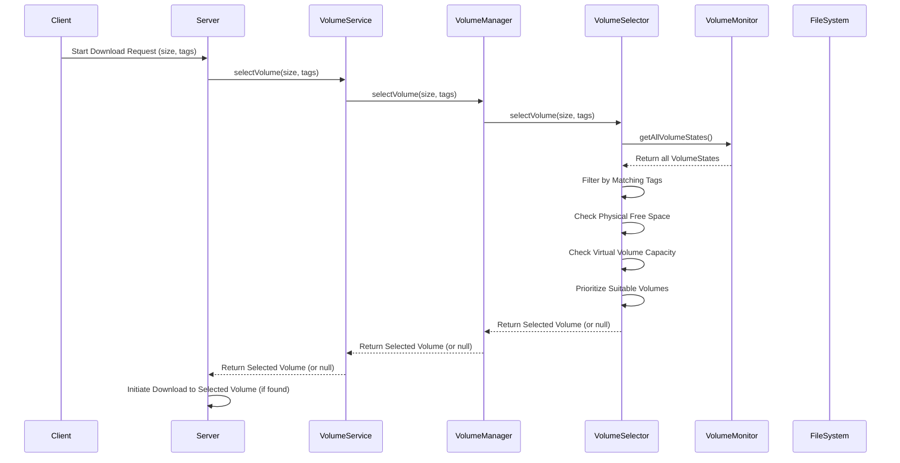

# Volumes Management

This document details the concept and management of volumes within the `downloads-server`.

## What is a Volume?

A volume represents a designated directory on the file system where downloaded content is stored. It acts as a logical storage unit for the `downloads-server`.

## Volume Configuration

Each volume is configured with the following key properties, primarily defined in the `config.json` file:

- **`path`**: The absolute path to the directory on the file system.
- **`maxSizeGB`**: An application-enforced limit for the total size of content within that specific directory (in Gigabytes). This limit **must not** exceed the physical storage capacity of its underlying partition.
- **`tags`**: A list of strings that categorize the volume. These tags are used to match download requests to suitable volumes.

## Volume Management Components

The `downloads-server` employs two primary components for managing volumes:

### 1. VolumeMonitor

The `VolumeMonitor` is responsible for continuously tracking the state of all configured volumes. Its key responsibilities include:

- **Periodic Updates**: Regularly checks and updates the following metrics for each volume:
  - **Physical Free Space (`freeSpaceBytes`)**: The actual free space available on the underlying physical disk partition where the volume resides.
  - **Current Usage (`currentUsageBytes`)**: The amount of space currently occupied by files within the volume's designated directory.
- **Directory Assurance**: Ensures that the configured volume directories exist on the file system.

### 2. VolumeSelector

The `VolumeSelector` is responsible for identifying the most suitable volume for a new download request. It leverages the up-to-date information provided by the `VolumeMonitor` to make informed decisions.

## Volume Selection Process

When a new download request is received, the `downloads-server` initiates a sophisticated volume selection process orchestrated by the `VolumeSelector`:

1.  **Tag Matching**: The `VolumeSelector` first filters all available volumes, considering only those that have at least one tag matching the tags specified in the download request.
2.  **Physical Space Check**: From the tag-matched volumes, it then verifies if the underlying physical disk partition has enough free space (`freeSpaceBytes`) to accommodate the estimated size of the new download.
3.  **Virtual Volume Space Check**: Additionally, it checks if the volume's configured `maxSizeGB` (virtual limit) has enough remaining capacity, considering its `currentUsageBytes`, to fit the new download.
4.  **Prioritization**: Among all volumes that satisfy the above criteria, the `VolumeSelector` prioritizes volumes with more available physical free space. If free space is equal, it uses the volume name for consistent selection.

## Importance of Volumes

Volumes are crucial for:

- **Storage Management**: Allowing users to define specific locations and limits for downloaded content.
- **Categorization**: Using tags to logically group and manage different types of downloads.
- **Preventing Disk Overflow**: The `maxSizeGB` helps prevent the `downloads-server` from filling up an entire disk partition.

Volumes are configured via the `config.json` file, providing a flexible and user-friendly way to manage download storage.
